# MML加工用 テキストエディタマクロ集

1. [SCC波形加工 for MGSDRV](#scc%E6%B3%A2%E5%BD%A2%E5%8A%A0%E5%B7%A5-for-mgsdrv)
2. [MML整形 for MGSDRV](#mml%E6%95%B4%E5%BD%A2-for-mgsdrv)
3. [MML転調 for MGSDRV](#mml%E8%BB%A2%E8%AA%BF-for-mgsdrv)
4. [MMLオクターブ検査 for MGSDRV](#mml%E3%82%AA%E3%82%AF%E3%82%BF%E3%83%BC%E3%83%96%E6%A4%9C%E6%9F%BB-for-mgsdrv)
5. [マクロの登録方法（サクラエディタ）](#%E3%83%9E%E3%82%AF%E3%83%AD%E3%81%AE%E7%99%BB%E9%8C%B2%E6%96%B9%E6%B3%95%E3%82%B5%E3%82%AF%E3%83%A9%E3%82%A8%E3%83%87%E3%82%A3%E3%82%BF)
6. [マクロの実行（サクラエディタ）](#%E3%83%9E%E3%82%AF%E3%83%AD%E3%81%AE%E5%AE%9F%E8%A1%8C%E3%82%B5%E3%82%AF%E3%83%A9%E3%82%A8%E3%83%87%E3%82%A3%E3%82%BF)
7. [更新履歴](#%E6%9B%B4%E6%96%B0%E5%B1%A5%E6%AD%B4)
----------------------------------------------------------------

# SCC波形加工 for MGSDRV

## File

- サクラエディタ/emEditor共用 javascriptマクロ  
  [scc_wave_mod.js](scc_wave_mod.js)

## 機能

MGSDRVのMML形式で記述されたSCC波形宣言データ用のを加工し、
n/256倍率をかけた波形データを出力するマクロです。

## 使い方

MGSDRVの波形宣言
```
@s0={ 001931475a6a757d7f7d756a5a47311900 e7cfb9a6968b8380838b96a6b9c7e7 }
```
を選択した状態でマクロを実行します。

すると入力ボックスで倍率を質問されるので入力します。  
倍率は256分の1単位なので128だと半分になります。

実行前  
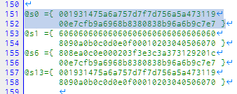

倍率入力  
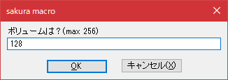

実行後  
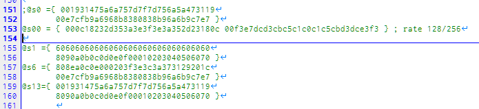

## 指定

- 'ボリュームは？(max 256)'  
  初期値 256   
  波形にかける音量倍率を指定します。
  - 256で100%
  - 512で200%
  - 128で50%


----------------------------------------------------------------

# MML整形 for MGSDRV

## File

- サクラエディタ/emEditor共用 javascriptマクロ  
  [mml_reformat.js](mml_reformat.js)

## 機能

- 選択した範囲のMMLを整形します。
- 選択していない場合はカーソル行を選択して整形します。
- 4分音符毎に空白を挿入します。
- 指定した1小節の長さで改行します。

使用前  
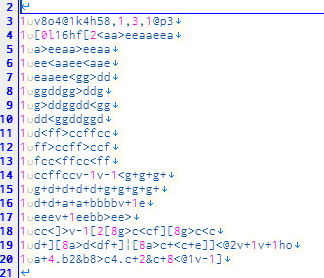

使用後  
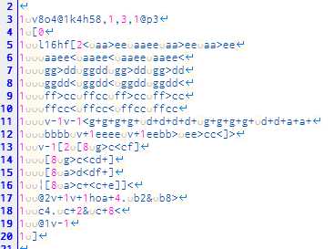

## 指定

マクロを実行すると以下の入力を求められます。

- '1小節の長さは？'  
   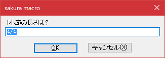  
  初期値 4/4  
  楽譜によくある指定方法です。  
  8/4なら4分音符が8個  
  6/8なら8分音符が6個

- '省略時の音長は？'  
  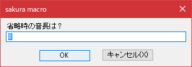  
  初期値 8  
  MMLのノートコマンド(cdefgab)で音量省略時の長さ。  
  整形対象の文字列中にLコマンドが無いときに有効です。

- 'ヘッダあり？(1=あり）'  
  初期値 1  
  行の先頭にチャンネルを指定する形式(MGSDRV書式)かどうかを指定します。  
  例) A @0v10ceged  
  ※ 実際には行頭からスペースが1つ見つかればそれ以降を本文扱いします。

## 使用例

- 自分の打ち込んだMMLが小節単位で揃っているかの確認をする。
- 元ファイルを紛失したとき
   [MSXPlay](https://msxplay.com/editor.html)へmgsファイルをドロップして生成されるMMLを整形して、再度MMLを修正しやすくする。


------------------------------------

# MML転調 for MGSDRV

## File

- サクラエディタ/emEditor共用 javascriptマクロ  
  [mml_transpose.jsee](mml_transpose.jsee)

## 機能

指定した度数だけ転調します。

使用前  
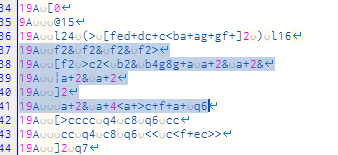

使用後  
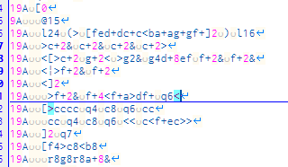

## 指定

マクロを実行すると以下の入力を求められます。

- '転調は何度? (±12で1オクターブ変化)'  
   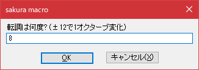  
   初期値 0  
   -12なら1オクターブ下げます。  
   12なら1オクターブ上げます。  

- 'ヘッダあり？(1=あり）'  
  初期値 1  
  行の先頭にチャンネルを指定する形式(MGSDRV書式)かどうかを指定します。  
  例) A @0v10ceged  
  ※ 実際には行頭からスペースが1つ見つかればそれ以降を本文扱いします。

------------------------------------

# MMLオクターブ検査 for MGSDRV

## File

- サクラエディタ/emEditor共用 javascriptマクロ  
  [mml_octave_check.jsee](mml_octave_check.jsee)

## 機能

選択範囲のオクターブ移動記号<>の数を数え、
最終的にプラスかマイナスであればその差分を表示します。

暫定で作ったため
- ループには非対応です。
- 絶対指定"o"には非対応です。

1行単位選択や、ループ内だけ選択で使用してみてください。


絶対指定→相対指定の書き換えマクロも想定して、
ループや絶対指定を認識させる処理は途中まで書きましたが、
MML整形より複雑になってきてしまいました。
そこまでする必要はない気がしますので途中でやめています。

余談ですが、ループのオクターブ変化引継ぎはドライバによって違うので面倒ですね。
- バイナリがブロックデータ形式だと繰り返しが影響しない
- MGSDRVは単に文字列を展開するだけなので繰り返しを引き継いで連続変化する

----------------------------------------------------------------
# マクロの登録方法（サクラエディタ）

1. 設定→共通設定

   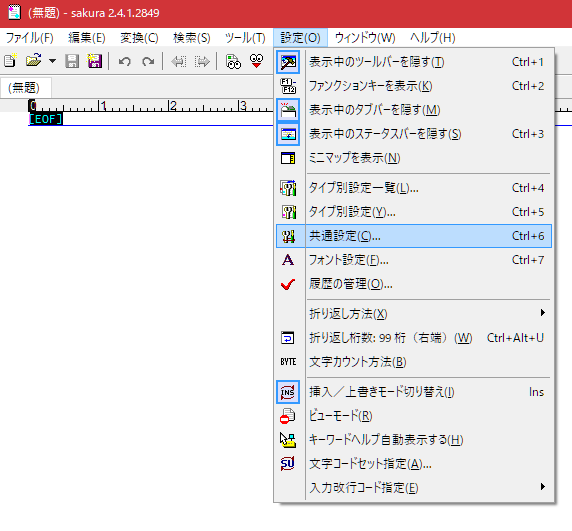

2. 「マクロ」タブ

   

   1. マクロのあるフォルダパスを指定
   2. 「名前(N)」を入力
   3. 「File」を選択 （※画像では日本語ファイル名に変えてます）
   4. 「設定(A)」ボタンを押して登録完了

3. 「キー割り当て」タブ

   

   1. 「種別(K)」で「外部マクロ」を選択
   2. 指定したいマクロを選んでキーを割り当てる

全ての設定が終わったら「OK」ボタンで閉じる

----------------------------------------------------------------
# マクロの実行（サクラエディタ）

1. キー割り当てした場合はそのキーを押す

2. 「ツール(T)」→「登録済みマクロ(b)」から実行する

	

------------------------------------

# 更新履歴

- 2023.07.30 (4)
  - サクラエディタとemEditorのマクロを一本化
  - SCC波形変更マクロを数値入力式に変更
  - サクラエディタでの出力改行コード修正
- 2023.07.30 (3)
  - ファイル名修正
  - mml_octave_check
    - サクラエディタ用追加
  - mml_transpose 追加
- 2023.07.30 (2)
  - mml_reformat
    - 最終ループ抜けコマンド"|"の時のインデントを１つ現象
- 2023.07.30
  - mml_reformat
    - ループ処理バグ修正
    - 文字エンコード修正
- 2023.07.29
  - mml_reformat
    - コメント改行バグ修正
    - 無限ループの改行処理追加
    - ループ階層でのインデント処理追加
- 2023.07.28 (2)
  - mml_reformat
    - コメント処理バグ修正
    - 改行処理修正
  -   ループコマンド対応
- 2023.07.28 (1)
  - 最初のアップロード
