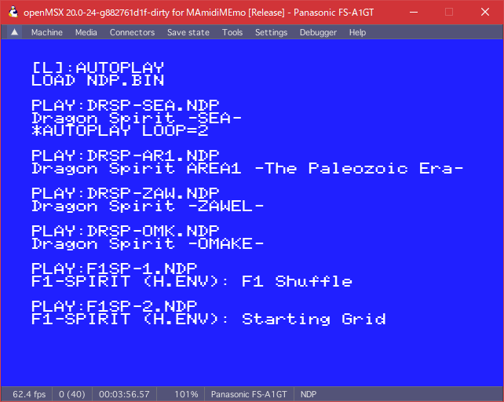
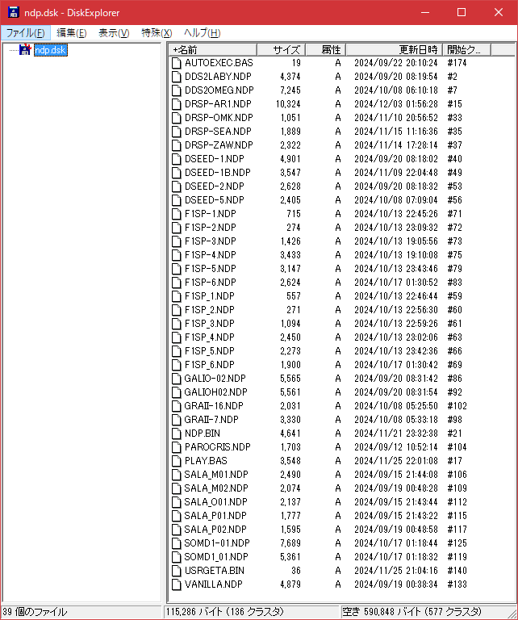

## NDPとは

なるとさんが開発中の高機能PSG音源ドライバ＆エディタ環境です。
現在クローズドβで開発進行中

- 現在PSGで出来る事を突き詰め中
- 快適なエディタと即時再生を助ける様々な機能
- リズムパートを独立して記述し、疑似的な4chを実現
  実際にリズム発声を割り込ませるチャンネルも動的に指定可能
- 面倒な処理を簡略化できる様々なコマンド
  例） ハードウェアエンベロープの音程制御、アルペジオ展開、セルフエコー


> NDP (PSG Driver for MSX) version 0.9.64     Programmed by naruto2413  
> NDP.BINは許諾を得て同梱しているものです。


## 視聴方法

NDP.BINとNDPファイルをロードしてBASICから再生する方法もありますが
KSSファイルを出力するので[M3disp](https://m3.ym2413.com/)でも再生可能です

1. Windows等で聞く

   ブラウザで https://m3.ym2413.com/ を開き、
   M3dispにkssをドロップして再生を実行。

   m3dispはMGSファイルなども直接再生可能です。

2. MSXで聞く
   
   MSXで演奏する際に使用するファイル

   - play.bas
   - NDP.BIN
   - USRGETA.BIN
   - *.NDP

   PLAY.BASは簡易プレイヤーになっています。
   - "L"キー：1曲演奏/2ループオートプレイの切り替え
   - その他のキーやジョイボタン：次の曲へ
   
   

   ディスクイメージ [../DSK_image/ndp.dsk](../DSK_image/ndp.dsk) もあります。
   
   


   > Windowsからディスクイメージの内容を操作したい場合は、DiskExplorerが便利です。
   >
   > https://www.vector.co.jp/soft/win95/util/se107750.html  
   >
   > - 2DD/FAT12はそのまま使えます
   > - HDDイメージは  
   >   (Manual HD)→  
   >   フォーマット「AT形式」→  
   >   パーティション「基本領域(FAT)」  
   >   を選択すると操作できます。
   
## プレイリスト作成バッチファイル

[_MAKE_KSS_PLAYLIST.BAT](_MAKE_KSS_PLAYLIST.BAT)

- 出力ファイルは
   - ndp_kss_playlist.m3u  ... SJIS
   - ndp_kss_playlist.m3u8 ... UTF8-BOM
- このファイルのあるフォルダとサブフォルダにあるkssファイルが対象
- パスは絶対パスで記録
- 表示名は相対パスで表示
- WinAmp文字化け対策の為UTF-8 BOM付きのm3u8も出力

WINAMP、foobar200、kbMediaPlayerいずれの場合でも、
kssファイルを生でを追加すると50曲ぐらいに内部展開されてうざいので、
kssファイル1つにつき1曲ずつだけ登録するプレイリスト
```ndp_kss_playlist.m3u``` (UTF-8版は```m3u8```)
を自動出力するバッチファイルを作りました。

Windows10以降、PowerShell2.0が入っている環境であれば使えると思います。

```_MAKE_KSS_PLAYLIST.BAT``` を kssファイルのあるフォルダに置いて実行してください。

出力された ```ndp_kss_playlist.m3u```
または ```ndp_kss_playlist.m3u8```
をプレイヤーにドロップすればすっきりした形でkssが追加されると思います。

## N3disp 直再生リンク

- ndpデータ全曲まとめパック  
  https://m3.ym2413.com/?open=https://github.com/uniskie/msx_music_data/blob/master/DSK_image/ndp-m3disp.zip

- "CASIO MSXソフト 「賢者の石」メドレー"  
  [ndp-kenja_no_ishi.kss]  
  https://m3.ym2413.com/?open=https://github.com/uniskie/msx_music_data/blob/master/ndp/ndp-kenja_no_ishi.kss

- "DANGEROUS SEED(MD) 1st TUBE (STAGE 1&8)"  
  [ndp-dangrous_seed_1.kss]  
  https://m3.ym2413.com/?open=https://github.com/uniskie/msx_music_data/blob/master/ndp/ndp-dangrous_seed_1.kss

- "DANGEROUS SEED(MD) Triple-Eye (Stage 1&9 BOSS)"  
  [ndp-dangrous_seed_1_boss.kss]  
  https://m3.ym2413.com/?open=https://github.com/uniskie/msx_music_data/blob/master/ndp/ndp-dangrous_seed_1_boss.kss

- "DANGEROUS SEED(MD) 2nd TUBE (STAGE 2&5)"  
  [ndp-dangrous_seed_2.kss]  
  https://m3.ym2413.com/?open=https://github.com/uniskie/msx_music_data/blob/master/ndp/ndp-dangrous_seed_2.kss

- "DANGEROUS SEED(MD) Jupiter (Stage 6&10)"  
  [ndp-dangrous_seed_5.kss]  
  https://m3.ym2413.com/?open=https://github.com/uniskie/msx_music_data/blob/master/ndp/ndp-dangrous_seed_5.kss

- "女神転生Ⅱ Labyrinth 午前２時の迷宮"  
  [ndp-dds2-Labyrinth.kss]  
  https://m3.ym2413.com/?open=https://github.com/uniskie/msx_music_data/blob/master/ndp/ndp-dds2-Labyrinth.kss

- "女神転生Ⅱ - OMEGA 聖戦 -" [ndp-dds2-omega.kss]  
  https://m3.ym2413.com/?open=https://github.com/uniskie/msx_music_data/blob/master/ndp/ndp-dds2-omega.kss

- "Dragon Spirit [AREA 1] -The Paleozoic Era- (like FC ver.)"  
  [ndp-dragon-spirit-area1-The_Paleozoic_Era.kss]  
  https://m3.ym2413.com/?open=https://github.com/uniskie/msx_music_data/blob/master/ndp/ndp-dragon-spirit-area1-The_Paleozoic_Era.kss

- "Dragon Spirit -OMAKE-  (like a FC ver.)"  
  [ndp-dragon-spirit-omake.kss]  
  https://m3.ym2413.com/?open=https://github.com/uniskie/msx_music_data/blob/master/ndp/ndp-dragon-spirit-omake.kss

- "Dragon Spirit -Sea- (like FC ver.)"  
  [ndp-dragon-spirit-sea.kss]  
  https://m3.ym2413.com/?open=https://github.com/uniskie/msx_music_data/blob/master/ndp/ndp-dragon-spirit-sea.kss

- "Dragon Spirit -Zawel- (like FC ver.)"  
  [ndp-dragon-spirit-zawel.kss]  
  https://m3.ym2413.com/?open=https://github.com/uniskie/msx_music_data/blob/master/ndp/ndp-dragon-spirit-zawel.kss

- "F1SPIRIT (H.ENV arr.) [F-1 Shuffle] (TITLE)"  
  [ndp-f1spirit-henv-1-F1_Shuffle.kss]  
  https://m3.ym2413.com/?open=https://github.com/uniskie/msx_music_data/blob/master/ndp/ndp-f1spirit-henv-1-F1_Shuffle.kss

- "F1SPIRIT (H.ENV arr.) [Starting Grid] (START)"  
  [ndp-f1spirit-henv-2-starting_grid.kss]  
  https://m3.ym2413.com/?open=https://github.com/uniskie/msx_music_data/blob/master/ndp/ndp-f1spirit-henv-2-starting_grid.kss

- "F1SPIRIT (H.ENV arr.) [D/G] (MACHINE SELECT)"  
  [ndp-f1spirit-henv-3-D_G.kss]  
  https://m3.ym2413.com/?open=https://github.com/uniskie/msx_music_data/blob/master/ndp/ndp-f1spirit-henv-3-D_G.kss

- "F1SPIRIT (H.ENV arr.) [Hot Summer Riding] (STOCK CAR RACE)"  
  [ndp-f1spirit-henv-4-hot_summer_riding.kss]  
  https://m3.ym2413.com/?open=https://github.com/uniskie/msx_music_data/blob/master/ndp/ndp-f1spirit-henv-4-hot_summer_riding.kss

- "F1SPIRIT (H.ENV arr.) [Random Approach] (RALLY RACE)"  
  [ndp-f1spirit-henv-5-random-approach.kss]  
  https://m3.ym2413.com/?open=https://github.com/uniskie/msx_music_data/blob/master/ndp/ndp-f1spirit-henv-5-random-approach.kss

- "F1SPIRIT (H.ENV arr.) [Next] (Retire)"  
  [ndp-f1spirit-henv-6-next.kss]  
  https://m3.ym2413.com/?open=https://github.com/uniskie/msx_music_data/blob/master/ndp/ndp-f1spirit-henv-6-next.kss

- "F1SPIRIT (Standard PSG) [F-1 Shuffle] (TITLE)"  
  [ndp-f1spirit-std-1-F1_Shuffle.kss]  
  https://m3.ym2413.com/?open=https://github.com/uniskie/msx_music_data/blob/master/ndp/ndp-f1spirit-std-1-F1_Shuffle.kss

- "F1SPIRIT (Standard PSG) [Starting Grid] (START)"  
  [ndp-f1spirit-std-2-starting_grid.kss]  
  https://m3.ym2413.com/?open=https://github.com/uniskie/msx_music_data/blob/master/ndp/ndp-f1spirit-std-2-starting_grid.kss

- "F1SPIRIT (Standard PSG) [D/G] (MACHINE SELECT)"  
  [ndp-f1spirit-std-3-D_G.kss]  
  https://m3.ym2413.com/?open=https://github.com/uniskie/msx_music_data/blob/master/ndp/ndp-f1spirit-std-3-D_G.kss

- "F1SPIRIT (Standard PSG) [Hot Summer Riding] (STOCK CAR RACE)"  
  [ndp-f1spirit-std-4-hot_summer_riding.kss]  
  https://m3.ym2413.com/?open=https://github.com/uniskie/msx_music_data/blob/master/ndp/ndp-f1spirit-std-4-hot_summer_riding.kss

- "F1SPIRIT (Standard PSG) [Random Approach] (RALLY RACE)"  
  [ndp-f1spirit-std-5-random-approach.kss]  
  https://m3.ym2413.com/?open=https://github.com/uniskie/msx_music_data/blob/master/ndp/ndp-f1spirit-std-5-random-approach.kss

- "F1SPIRIT (Standard PSG) [Next] (Retire)"  
  [ndp-f1spirit-std-6-next.kss]  
  https://m3.ym2413.com/?open=https://github.com/uniskie/msx_music_data/blob/master/ndp/ndp-f1spirit-std-6-next.kss

- "MAZE of GALIOUS [START] ~ [CASTLE] henv-base"  
  [ndp-galious-castle.kss]  
  https://m3.ym2413.com/?open=https://github.com/uniskie/msx_music_data/blob/master/ndp/ndp-galious-castle.kss

- "MAZE of GALIOUS [START] ~ [CASTLE] normal-base"  
  [ndp-galious-castle-nr.kss]  
  https://m3.ym2413.com/?open=https://github.com/uniskie/msx_music_data/blob/master/ndp/ndp-galious-castle-nr.kss

- "GRADIUS II AC - Synthetic Life - [NDP Arrange]"  
  [ndp-graii-7.kss]  
  https://m3.ym2413.com/?open=https://github.com/uniskie/msx_music_data/blob/master/ndp/ndp-graii-7.kss

- "GRADIUS II AC - Shoot & Shoot - [NDP Arrange]"  
  [ndp-graii-16.kss]  
  https://m3.ym2413.com/?open=https://github.com/uniskie/msx_music_data/blob/master/ndp/ndp-graii-16.kss

- "PARODIUS 中ボス - クライシス第４楽章"  
  [ndp-paro-crisis.kss]  
  https://m3.ym2413.com/?open=https://github.com/uniskie/msx_music_data/blob/master/ndp/ndp-paro-crisis.kss

- "SALAMANDER [ POWER OF ANGER ]"  
  [ndp-saramander-1-power_of_anger.kss]  
  https://m3.ym2413.com/?open=https://github.com/uniskie/msx_music_data/blob/master/ndp/ndp-saramander-1-power_of_anger.kss

- "SALAMANDER [ POWER OF ANGER ] (no use H.ENV)"  
  [ndp-saramander-1-power_of_anger-nh.kss]  
  https://m3.ym2413.com/?open=https://github.com/uniskie/msx_music_data/blob/master/ndp/ndp-saramander-1-power_of_anger-nh.kss

- "SALAMANDER [ POWER OF ANGER ] (test - main: H.ENV)"  
  [ndp-saramander-1-power_of_anger-another.kss]  
  https://m3.ym2413.com/?open=https://github.com/uniskie/msx_music_data/blob/master/ndp/ndp-saramander-1-power_of_anger-another.kss

- "SALAMANDER [ FLY HIGH ]"  
  [ndp-saramander-2-fly_high.kss]  
  https://m3.ym2413.com/?open=https://github.com/uniskie/msx_music_data/blob/master/ndp/ndp-saramander-2-fly_high.kss

- "SALAMANDER [ FLY HIGH ] (No H.Env)"  
  [ndp-saramander-2-fly_high-nr.kss]  
  https://m3.ym2413.com/?open=https://github.com/uniskie/msx_music_data/blob/master/ndp/ndp-saramander-2-fly_high-nr.kss

- "SORCERIAN MD - 灰色のダンジョン(THE DARKEST OF THE DARK) - DUNGEON [H.ENV]"  
  [ndp-sorcerian_md-gray_dungeon-dungeon.kss]  
  https://m3.ym2413.com/?open=https://github.com/uniskie/msx_music_data/blob/master/ndp/ndp-sorcerian_md-gray_dungeon-dungeon.kss

- "SORCERIAN MD - 灰色のダンジョン(THE DARKEST OF THE DARK) - DUNGEON [Std]"  
  [ndp-sorcerian_md-gray_dungeon-dungeon-std.kss]  
  https://m3.ym2413.com/?open=https://github.com/uniskie/msx_music_data/blob/master/ndp/ndp-sorcerian_md-gray_dungeon-dungeon-std.kss

- "ヴァ〇ニラの求人 NDP祭り"  
  [ndp-vanilla.kss]  
  https://m3.ym2413.com/?open=https://github.com/uniskie/msx_music_data/blob/master/ndp/ndp-vanilla.kss

