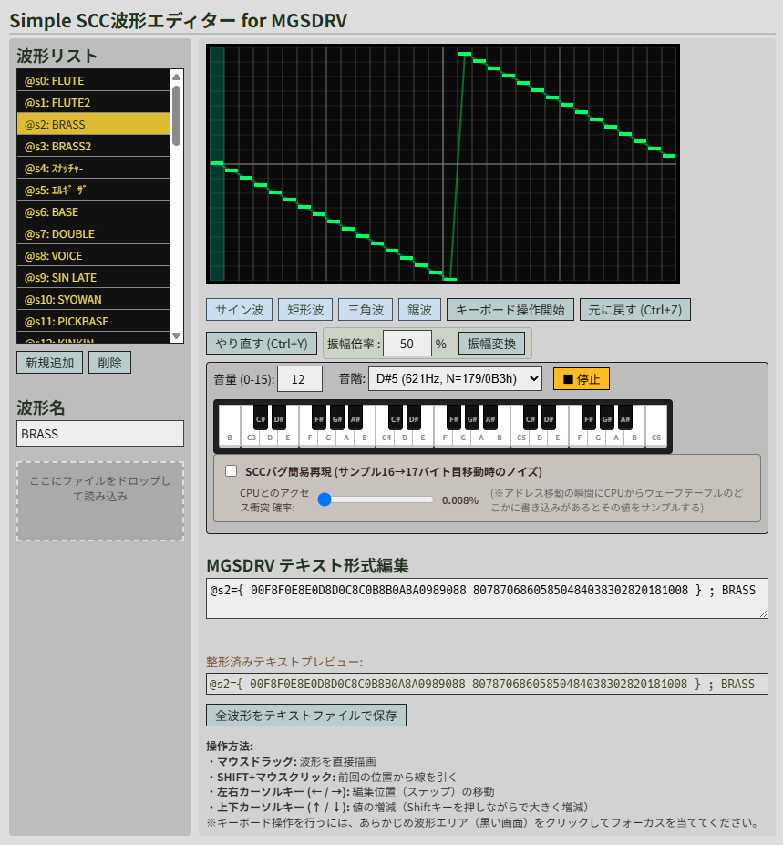
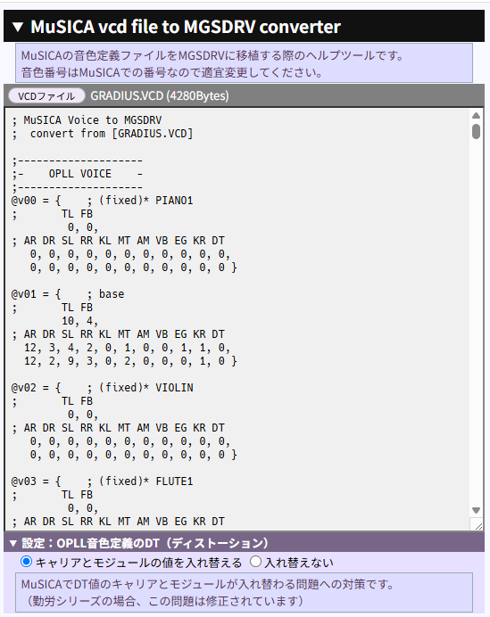

# scc_edit (HTML)

## Simple SCC波形エディタ for MGSDRV
SCC波形を編集するツール

https://uniskie.github.io/msx_music_data/tool/scc_edit.html

htmlソースコード [scc_edit.html](scc_edit.html)  
(ダウンロードしてブラウザで開いて使用できます)

### 主な機能
- **グラフ編集**と**MMLテキスト形式**の連動
- **振幅調整**
- **音の再生プレビュー**  
  ついでなので簡易実装。  
  - 位相や遅延は考慮していません。
  - 
- **MMLファイルの読み込み**  
  MGSDRV用のMMLファイルをドロップすれば適当にSCC波形定義を拾います。
- 波形リスト管理
- エクスポート

gemini3.5 Flashを併用して時短作成しています。

SCCの音量問題に対策するため、波形側で音量（振幅）を調整するケースがそれなりにあり、手軽に振幅を変更する機能を用意するついでに編集機能も付けました。

以前は[テキストエディタ＋マクロ](../macro/scc_wave_mod.js)で処理していましたが、ブラウザ用ツールとしてまとめた方が手軽だと思いますので、用意してみました。

# vcd_conv (HTML)

音色定義ファイル(vcdファイル)をMGSDRV形式で表示するツール

https://uniskie.github.io/msx_music_data/tool/vcd_conv.html

htmlソースコード [vcd_conv.html](vcd_conv.html)  
(ダウンロードしてブラウザで開いて使用できます)

- 2026/07/25 追記  
  以前は別途jsが必要で、html単体では動作しなかったのですが、修正しました。

# FMBIOS TOOLS

OPLDRV_tool.exe  
... FMBIOS内蔵の音源ドライバ（通称OPLDRV）データを解析するツール

https://github.com/uniskie/MSX_MISC_TOOLS/tree/main/OPLDRV_BGM_EXTRACT  
（別Repository）

# 資料関係

https://github.com/uniskie/msx_music_data/tree/master/doc

# 謝辞と参照資料

- 裕之様  
  SCC実験室/SCCの仕様 https://d4.princess.ne.jp/msx/scc/scc2.html
- 3MHz様
  SCMD/SCCインターリーブ切り替え https://cpu.8bitsize.com/3mhz/index/03/scc-int.php
  

- MGSDRV Ⓒ Ain./Gigamix https://www.gigamix.jp/mgsdrv/

